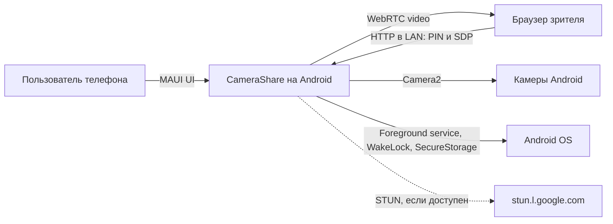
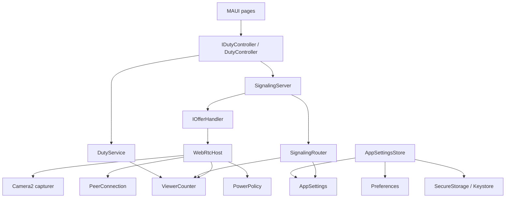
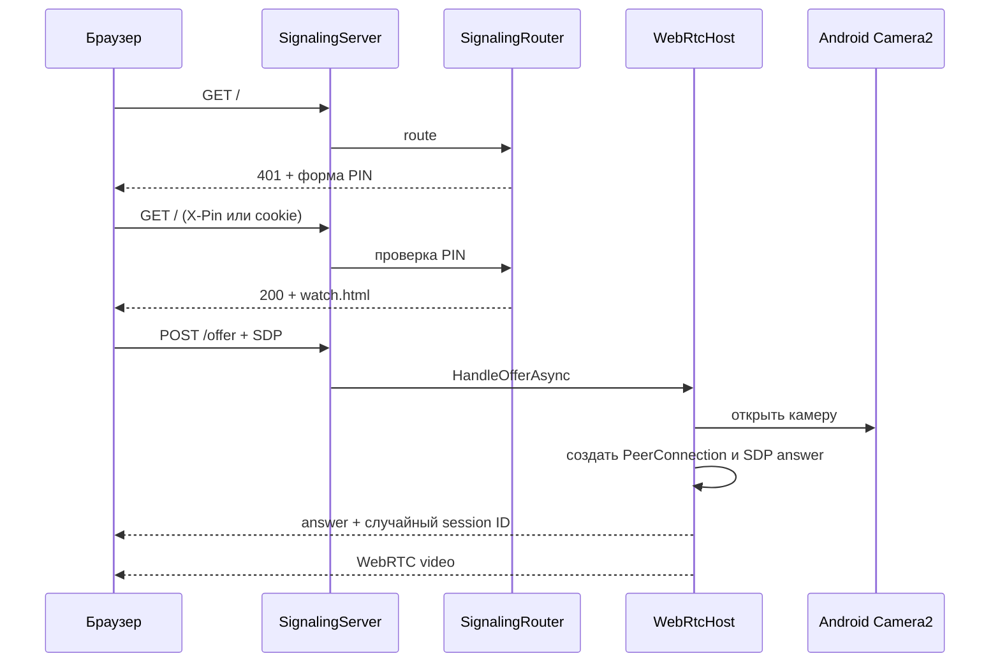

# Архитектура CameraShare

Документ описывает CameraShare 1.5.0 (`versionCode` 19) по состоянию на 18 августа 2026 года.

## Назначение и границы

CameraShare превращает Android-телефон в локальную видеоняню:

- телефон публикует HTTP-интерфейс только в локальной сети;
- браузер зрителя проходит проверку четырёхзначным PIN;
- видео передаётся напрямую по WebRTC;
- камера включена только во время активной сессии;
- одновременно поддерживается один зритель;
- облако, аккаунты, TURN/SFU и локальный HTTPS не входят в архитектуру.

Система состоит из Android-приложения и страницы зрителя, встроенной в сборку как HTML-ресурс. Отдельного backend-сервера нет.

## Контекст



STUN помогает собрать ICE-кандидаты, но медиапоток не отправляется через сервер CameraShare. Для обычной домашней LAN-сети используются host-кандидаты; при недоступном STUN ответ всё равно формируется после тайм-аута сбора ICE.

## Структура решения

Решение `AndroidCameraShare/AndroidCameraShare.slnx` содержит три проекта.

### `AndroidCameraShare.Core`

Платформонезависимая логика на `net10.0`:

- `AppSettings` и `NannyConstants` — модель настроек и системные лимиты;
- `SignalingRouter` — синхронная маршрутизация и проверка PIN;
- `SignalingServer` — жизненный цикл `HttpListener`, ограничение параллелизма и вызов WebRTC-адаптера;
- `IOfferHandler` — порт между Core и Android WebRTC;
- `ViewerCounter` — состояние единственного зрителя;
- `ViewerPage` и `Pages/*.html` — встроенный браузерный клиент;
- `RotatingFileLoggerProvider` — ограниченный файловый журнал для Release.

Core не ссылается на Android API, MAUI UI или конкретную реализацию камеры.

### `AndroidCameraShare`

MAUI-приложение только для `net10.0-android`:

- `MainPage`, `SettingsPage`, `CameraPreviewPage` — UI телефона;
- `MauiProgram` — composition root и регистрация singleton/transient-зависимостей;
- `DutyController` — прикладной координатор дежурства;
- `DutyService` — Android foreground service, удерживающий процесс;
- `WebRtcHost` — реализация `IOfferHandler` на libwebrtc/Camera2;
- `PowerPolicy` — CPU/Wi-Fi lock и затемнение окна на время сессии;
- `AppSettingsStore` и `SecurePinStorage` — сохранение настроек и PIN;
- `BootReceiver` — опциональный запуск дежурства после перезагрузки;
- `LocalCameraPreview` и handler — локальная проверка камеры.

### `AndroidCameraShare.Tests`

xUnit-тесты Core-контрактов и частей инфраструктуры, не требующих Android-устройства: маршруты, PIN, SDP, HTML, счётчик зрителей, версия, поиск LAN-адреса и файловое логирование.

## Компоненты времени выполнения



Все живые сервисы регистрируются в `MauiProgram`. `AppSettings`, сервер, контроллер, WebRTC-хост, счётчик и политика питания живут как singleton в пределах процесса. Страницы настроек и превью создаются на переход.

## Основные сценарии

### Запуск дежурства

1. `MainPage` вызывает `IDutyController.StartAsync()`.
2. `DutyController` загружает PIN из `SecureStorage` и запрещает старт без корректного PIN.
3. Контроллер запрашивает необходимые Android-разрешения и определяет IPv4 активной сети.
4. `SignalingServer` открывает `HttpListener` на настроенном порту. Если bind конкретного адреса не поддержан Android, используется `+`, а пользователю всё равно показывается LAN-адрес.
5. После успешного HTTP-start запускается `DutyService` с типом `dataSync`.
6. Ошибка запуска foreground service приводит к остановке HTTP, чтобы UI и фактическое состояние не расходились.

При включённом автозапуске `BootReceiver` повторяет сценарий без показа диалогов разрешений. `DutyService` также восстанавливает HTTP после перезапуска процесса системой.

### Подключение зрителя



`WebRtcHost` сериализует операции сессии через `SemaphoreSlim`. Вторая попытка просмотра получает `409`. Управляющие `/hangup` и `/camera` требуют одновременно PIN и идентификатор текущей сессии.

### Остановка и восстановление

- `/hangup` закрывает WebRTC и камеру, освобождает lock’и, но не выключает HTTP-дежурство.
- `ICE failed` закрывает сессию сразу; `ICE disconnected` получает короткое окно на восстановление.
- Если ICE не подключился за установленный тайм-аут, сессия закрывается.
- Страница зрителя повторяет подключение после краткого разрыва или возврата из фона.
- Выключение дежурства сначала завершает сессию и кратко оставляет HTTP доступным, чтобы зритель получил причину остановки, затем закрывает listener и foreground service.

## HTTP-контракт

- `GET /` — форма PIN либо страница просмотра;
- `GET /health` — состояние дежурства, число зрителей и версия, без PIN;
- `GET /status` — заряд, выбранная камера и состояние дежурства;
- `POST /offer` — WebRTC SDP offer/answer;
- `POST /hangup` — остановка текущей сессии;
- `POST /camera` — смена камеры текущей сессии.

Тело `/offer` ограничено 64 КиБ. Сервер допускает не более восьми одновременно обрабатываемых запросов; запрос, не попавший в очередь за 100 мс, получает `503`. Неуспешные PIN-попытки кратко ограничиваются по IP.

## Данные и состояние

- обычные настройки хранятся через MAUI `Preferences`;
- PIN хранится через `SecureStorage`, использующий Android Keystore;
- старый PIN из `Preferences` переносится при первом чтении и удаляется;
- session ID — 128 случайных бит в hex, существует только в памяти;
- SDP, PIN и cookie не должны сохраняться;
- Release-логи хранятся в каталоге данных приложения: до трёх файлов по 512 КиБ.

Приложение не имеет собственной базы данных и не хранит видеопоток.

## Безопасность и доверительные границы

Граница доверия проходит по локальному HTTP-интерфейсу. Защита рассчитана на домашнюю LAN, а не на недоверенную публичную сеть.

Принятые меры:

- PIN не включается в URL или QR и сравнивается за фиксированное время;
- управляющие запросы привязаны к случайному session ID;
- лимитируются размер offer, число параллельных запросов и частота неверных PIN;
- `allowBackup=false`, `DutyService` не экспортируется;
- PIN хранится в Keystore;
- логгер маскирует PIN, cookie и SDP;
- камера и lock’и создаются только для активной сессии;
- освобождение камеры, `PeerConnection`, capturer и lock’ов выполняется при stop и при ошибках.

Ограничения:

- HTTP не шифрует PIN и signaling-трафик; пользователь в той же сети может их перехватить;
- четырёхзначный PIN не заменяет сетевую изоляцию;
- listener может слушать все интерфейсы при fallback на `+`;
- публичный `/health` раскрывает версию и факт работы;
- внешний Google STUN создаёт исходящий сетевой запрос и раскрывает Google сетевой адрес устройства;
- приложение не предназначено для публикации порта в Интернет.

## Управление ресурсами

- в простое камера, CPU WakeLock и Wi-Fi lock выключены;
- во время просмотра CPU WakeLock включён всегда, Wi-Fi lock — только в режиме надёжного приёма;
- тип foreground service меняется с `dataSync` на `dataSync|camera` только при активной камере;
- `PeerConnectionFactory` и EGL живут до конца процесса: повторное уничтожение нативного signaling thread нестабильно;
- очередь файлового логгера ограничена 1024 сообщениями и при перегрузке отбрасывает новые записи;
- страница зрителя запрашивает Screen Wake Lock, но браузер может запретить его для LAN HTTP.

## Логирование и диагностика

В Debug используется Android/IDE debug logging. В Release — `RotatingFileLoggerProvider`.

Уровни:

- `Information` — старт/стоп дежурства и сессии, смена камеры;
- `Warning` — неверный PIN без его значения, отсутствие разрешений, ICE timeout, занятый порт;
- `Error` — сбои HTTP, WebRTC и управления службой.

Журналы не являются телеметрией и никуда не отправляются.

## Архитектурные решения

- Один процесс и встроенный HTTP вместо отдельного backend: меньше развёртывания и данных вне LAN.
- Core отделён от Android: маршрутизация и политики тестируются без устройства.
- Один зритель: исключает SFU и конкуренцию за камеру.
- Non-trickle ICE: простой HTTP offer/answer без WebSocket; старт может ждать сбор ICE до трёх секунд.
- Foreground service отделён от HTTP и камеры: служба удерживает процесс, а камера остаётся сессионным ресурсом.
- HTML встроен в Core: версия браузерного клиента всегда совпадает с APK.

## Проверка изменений

Для изменений Core и контрактов:

```powershell
dotnet test AndroidCameraShare/AndroidCameraShare.Tests/AndroidCameraShare.Tests.csproj
```

Для Android-интеграции дополнительно требуется сборка проекта и ручная проверка на устройстве:

```powershell
dotnet build AndroidCameraShare/AndroidCameraShare/AndroidCameraShare.csproj
```

Особенно важно проверять: старт/стоп foreground service, выдачу разрешений, hangup без остановки HTTP, повторное подключение, смену камер, выключение экрана и освобождение камеры после ошибки.

## Правила развития

- платформонезависимые правила оставлять в Core;
- Android API и libwebrtc не протаскивать через границу `IOfferHandler`;
- не добавлять облако, многопользовательский SFU или постоянную запись без отдельного архитектурного решения;
- при добавлении маршрута описать PIN/session требования и добавить тесты;
- при изменении потоков или жизненного цикла обновить этот документ и README.
